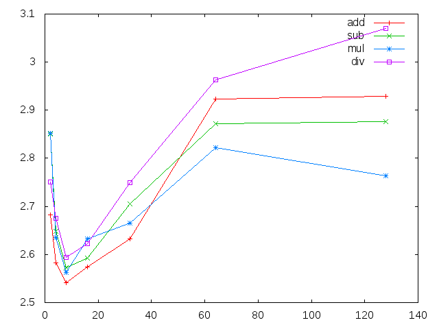
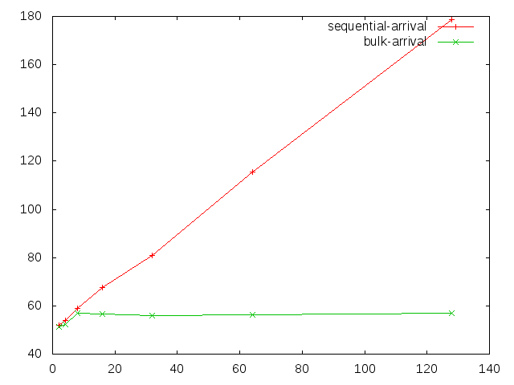

% COS470 - Trabalho 3
% Autor: Bernardo Amorim; Professor: Daniel Ratton Figueiredo

# RPC - Remote Procedure Call

É o fato de uma subrotina de um determinado sistema acontecer em outro espaço de endereçamento (seja num outro processo ou numa outra máquina) mas que parece acontecer exatamente como uma rotina local. 

## Como funciona e desafios

O fato de acontecer em outro espaço de endereçamento implica que não necessariamente há memória compartilhada, portanto a comunicação deve ser feita por troca de mensagens.

Portanto, para que o RPC aconteça existe todo um processo complicado de transformar chamadas de função em mensagem e transformar mensagens em chamada de função, bem como mensagens para retorno e excessões. Além disso existe a dificuldade de implementar toda a camada de transporte, gerenciamento de sockets, bufferização, etc... Muito trabalho repetitivo.

## Decisão técnica - Apache Thrift

Para não focar nos diversos problmas do RPC, foi escolhida a biblioteca *Thrift*, desenvolvida pelo *Facebook* e sob licensa aberta em um projeto *Apache*.

O *Thrift* resolve todo o problema de Marshalling/Unmarshalling bem como (em certo nível) os problemas de escalonamento do serviço, tratamento das mensagens e comunicação.

Para isso ele conta com as seguintes partes fundamentais:

* Uma linguagem de descrição de tipos e serviços (interfaces): arquivos .thrift
* Um compilador que gera código em diversas plataformas dado um arquivo .thrift
* Bibliotecas de cliente que facilitam a criação dos servidores e todas sua infraestrutura.

Para demonstrar o uso, foi escrita a seguinte definição de interface: Ver Anexo 1

## Implementando o serviço

Basicamente as operações funcionam da seguinte forma: Ao receber um vetor de tamanho N, pré-aloca N espaços no vetor de retorno e para cada elemento do vetor de entrada realiza a operação e coloca o resultado no vetor de retorno.

O Thrift oferece 3 tipos de servidor já prontos em sua biblioteca: *TSimpleServer*, que permite 1 execução simultânea apenas. *TThreadedServer*, que levanta uma thread para cada requisição (o que pode ser um problema em larga escala). E a *TThreadPoolServer*, que tem um *pool* de N threads para atender até N requisições simultâneas, evitando alocar mais threads do que o permitido pelo Sistema Operacional.

## Implementando o cliente

Foi feito um cliente que gera grandes vetores aleatórios usando um Mersenne Twister e em seguida particiona o vetor em K partições, copiando elas para cada uma das K threads. Cada thread por sua vez, faz uma chamada RPC e depois copia sua parte para a partição correspondente no vetor original.

Ver Anexo 2

## Resultados

Foi medido o tempo médio para cada operação (soma, subtração, divisão e multiplicação) para cada numero de threads. A máquina rodada foi um i5 (com 4 núcleos).



# Exclusão Mútua

Num Sistema Distribuido as vezes é necessario garantir que apenas um processo esteja executando uma determinada tarefa, ou seja, garantir exclusão mútua.

Exclusão mútua com memória compartilhada é um problema fácil, pois já podemos usar locks, semáforos e outras ferramentas a nossa disposição.

Agora para resolver exclusão mútua em processos distribuidos que se comunicam apenas por troca de mensagem é mais complicado.

Um jeito mais fácil é usar um processo como coordenador no qual os outros processos "pedem" para ele permissão para entrar na região crítica. O trabalho do coordenado e saber quando liberar e quando pedir para um processo esperar para entrar na região.

## Solução

Foi utilizada a linguagem *Elixir*, que roda em cima da máquina virutal do *Erlang*, a *BEAM*.

O motivo de usar algo na *BEAM* e que ela implementa um conceito chamado de *microprocessos*. A idéia é que os *microprocessos* são semelhantes semanticamente aos processos do Sistema Operacional, só que são muito mais leves. Além disso a máquina virtual tem um próprio *scheduler* bem eficiente.

Além disso, *Erlang* foi desenvolvido pela Ericsson para criar sistemas distribuidos com alta disponibilidade e é bastante testado em sistemas reais. (Por exemplo, o *Whatsapp* tem seu servidor em *Erlang* e já foi dito que esse era o segredo para atender 1 bilhão de usuários com um time de 50 desenvolvedores).

*Elixir* é uma linguagem que tem total interoperabilidade com o ecossistema *Erlang* e que traz algumas ferramentas a mais:
* Homoiconicidade + Sistema de macros inspirado em Lisp (Metaprogramação!)
* Polimorfismo de dados (Sem precisar de OO nem mutabilidade)
* Imutabilidade
* E tudo que existe de bom em Erlang

Mas o que realmente facilitou em ter utilizado *Elixir* (seria o mesmo em *Erlang*) é que os *microprocessos* tem uma caixa de mensagem e tem construtores de *send* e *receive* implementados no core da máquina virtual e da linguagem.

### Writer

Ao chamar o método acquire, o writer envia uma mensagem para o *master* contendo o pedido de *acquire* e seu identificador do processo. Em seguida ele espera uma mensagem do *master* contendo *grant*

Ver Anexo 3

## Coordenador (Master)

É aqui que a mágica da coordenação acontece. O coordenador pode receber 2 tipos de mensagem:

* *acquire*: Se ninguem está executando a região crítica neste momento, envia imediatamente a mensagem de *grant* para o processo, caso contrário o adiciona numa fila de espera
* *release*: Se o processo é o que está na região critica atualmente e se tem alguem esperando para entrar an região crítica, remove quem está em espera da fila, envia-lhe uma mensagem de *grant*. Caso o processo seja o que está na região crítica mas ninguem está na fila de espera, não faz nada.

Ver Anexo 4

## bulk-arrival e sequence-arrival

Para disparar as tarefas, foi feito um código que inicializa o *master* e depois cria diversos *writers* e os espera terminar. Caso o modo seja em sequence arrival, cria um processo por vez, dorme por um tempo determinado e continua.

## Resultados



--------

# Anexos

## vector_math.thrift
```thrift
exception ArithmeticException {
  1: string message;
}

service VectorMath {
  list<i32> add(1:list<i32> vec, 2:i32 num);
  list<i32> sub(1:list<i32> vec, 2:i32 num);
  list<i32> mul(1:list<i32> vec, 2:i32 num);
  list<i32> div(1:list<i32> vec, 2:i32 num) throws (1: ArithmeticException divideByZero);
}
```

## ex_client.cpp (parcial)

```cpp
  for(auto i = 0; i < K; i++){
    auto start = numbers.begin() + i*step;
    threads.push_back(std::thread([start, step, operation, operand, host, port](){
      // ...
      // Initialization
      // ...

      std::vector<int32_t> sub(start, start+step);
      
      // ...
      // Exec RPC call
      // ...

      std::copy(sub.begin(), sub.end(), start);
    }));
  }
```

## writer.ex

```elixir
defmodule Lock.Writer do
  def run(_, _, 0), do: nil
  def run(master, name, remaining) do
    {:ok, file} = File.open("chat.txt", [:write, :append])

    # Write many times so it flushes in parts
    # This is just to create a race condition even on single-core computers
    acquire(master)
    IO.write(file, name)
    IO.write(file, "is writing")
    IO.write(file, "\n")
    release(master)

    Process.sleep(:rand.uniform(1000))
    run(master, name, remaining - 1)
  end

  defp release(master), do: send master, {:release, self}

  defp acquire(master) do
    send master, {:acquire, self}
    wait_grant
  end

  defp wait_grant() do
    receive do
      :grant -> true
      _ -> wait_grant
    end
  end
end
```

## master.ex

```elixir
defmodule Lock.Master do
  def run do
    step
  end

  def step(queue \\ [], current \\ nil) do
    receive do
      {:acquire, pid} -> acquire(queue, current, pid)
      {:release, pid} -> release(queue, current, pid)
      :exit -> nil
      _ -> step(queue, current)
    end
  end

  def acquire(queue, nil, pid) do
    send pid, :grant
    step(queue, pid)
  end
  def acquire(queue, current, pid), do: step(queue ++ [pid], current)

  def release([], curr, curr), do: step([], nil)
  def release([next|queue], curr, curr) do
    send next, :grant
    step(queue, next)
  end
  def release(queue,curr,_), do: step(queue,curr)
end
```
